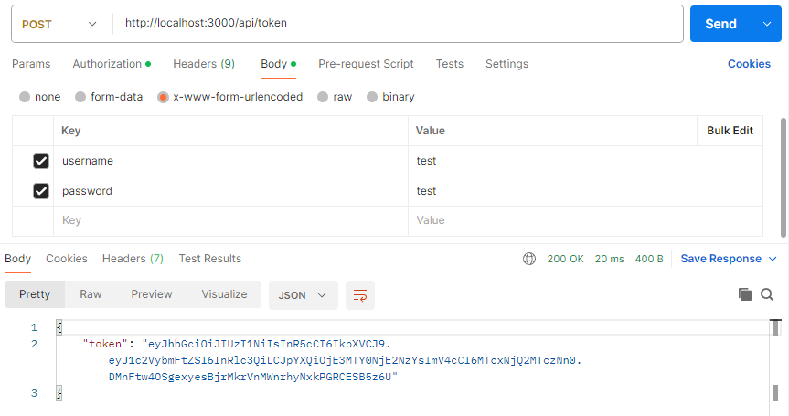
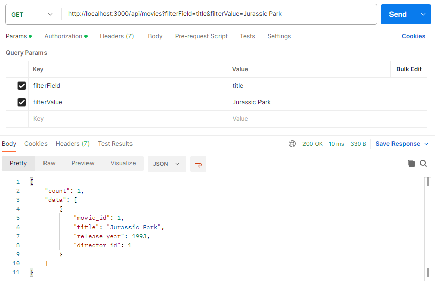
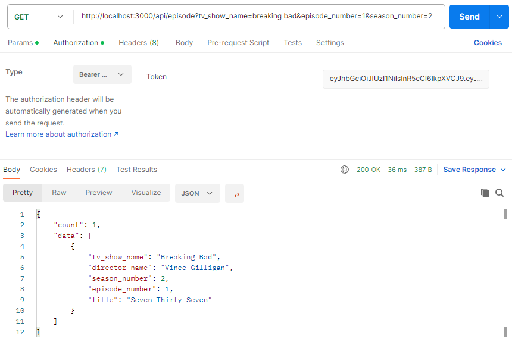
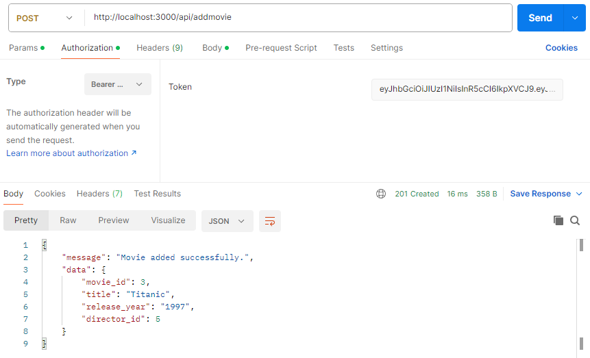

## Development Challenge for Node.js

This API use MySQL, Sequelize ORM and JasonWebToken were used for the development.


## Install

```
git clone https://github.com/feblesariel/nubceo_challenge.git
```

*Create the database with the script inside the "db" folder.

*Create an .env file in the root of the project and add the following environment variables.

NAME=test<br>
PASS=test<br>
JWT_SECRET=test

```
npm install
```
```
npm start
```

## Endpoints

### Get Token

- **URL:** `POST /api/token`
- **Description:** This endpoint is used to obtain the JWT access token, which is programmed to last for 1 minute.
- **Example:**





### Get Movies (token required)

- **URL:** `GET /api/movies`
- **Description:** This endpoint is used to get a list of movies.
- **Optional Query Parameters:** Optional Query Parameters: Filters and sorting can be applied to the list of movies.
- **Example:**





### Get TV Show Episode (token required)

- **URL:** `GET /api/episode`
- **Description:** This endpoint is used to obtain information about a specific episode of a TV show, including the director.
- **Optional Query Parameters:** Filters and sorting can be applied to the requested episode.
- **Example:**





### Add Movie (token required)

- **URL:** `POST /api/addmovie`
- **Description:** This endpoint is used to add a movie.
- **Example:**


